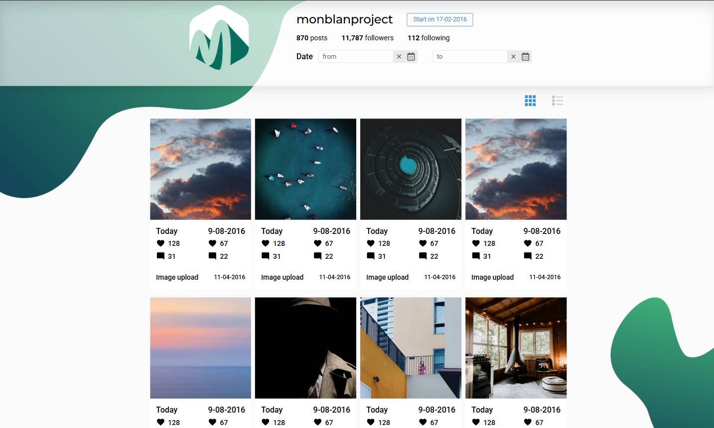
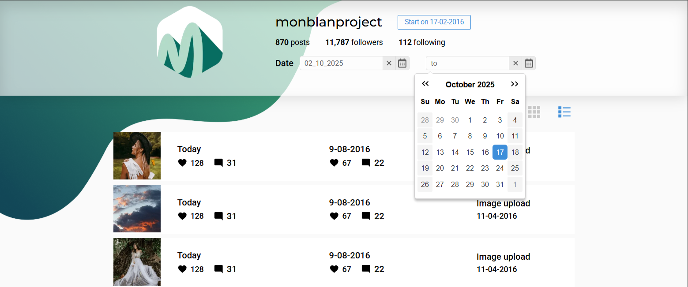
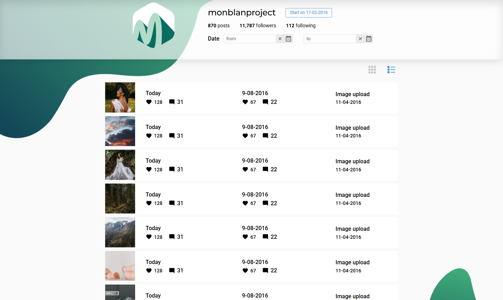

# 📸 Webspark Monblan Project

A responsive gallery web app built as a test project for Webspark.

The interface imitates a social media profile — displaying posts as image cards with likes, comments, and upload dates.

Users can filter posts by date range and switch between grid and list layouts.


🔗 [Live Demo](https://webspark-monblanproject.vercel.app/)  

---

## ✨ Features
- 🏠 **Profile section** 

  - Displays total posts, followers, following count, and profile start date
  - Clean, minimal UI with smooth layout transitions



- 🗓️ Date filter

  - Users can filter posts by "from — to" range using a custom calendar picker (react-datepicker)



- 🖼️ Posts grid / list view

  - Toggle between two layout styles
  - Each post displays upload date, number of likes ❤️, and comments 💬



- 📱 Responsive design

  - Adaptive layout for mobile, tablet, and desktop screens
  - Smooth adjustments via react-responsive breakpoints

---

## 🛠️ Tech Stack

  - ⚡ Vite — fast development environment
  - ⚛️ React 19 + TypeScript
  - 🎨 CSS Modules + clsx for modular styles
  - 📅 react-datepicker for date filtering
  - 📱 react-responsive for adaptive UI
  - 🧩 modern-normalize for cross-browser styling consistency

---

## 🚀 Run Locally

1. Clone the repository:
   ```bash
   git clone https://github.com/sofi-dobriak/webspark-monblanproject.git
2. Navigate to the project folder:
    ```bash
    cd webspark-monblanproject
3. Install dependencies:
    ```bash
    npm install
4. Start the development server:
    ```bash
    npm run dev
5. Open in your browser:
    ```bash
    http://localhost:5173
---

👩‍💻 Author: Sofi Dobriak